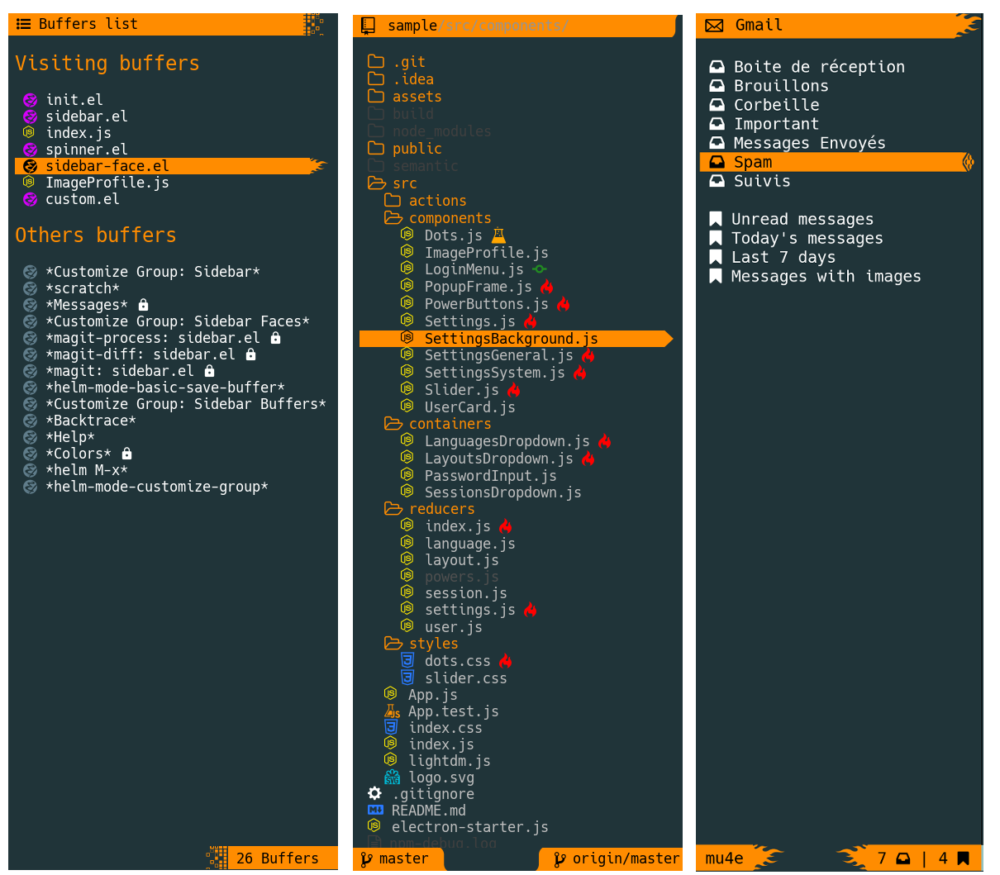
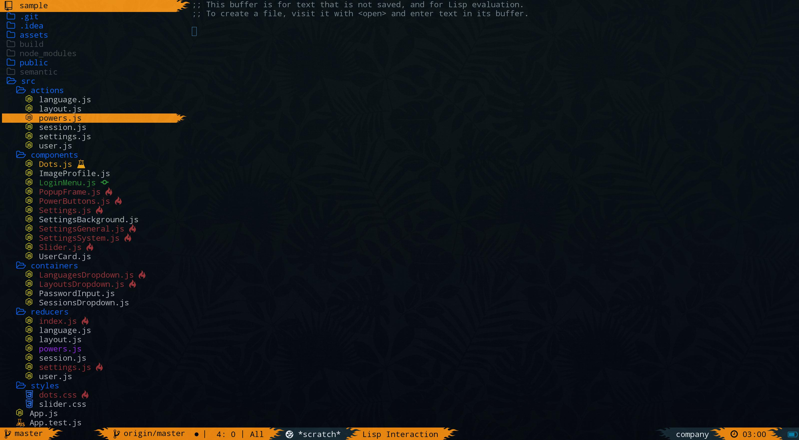
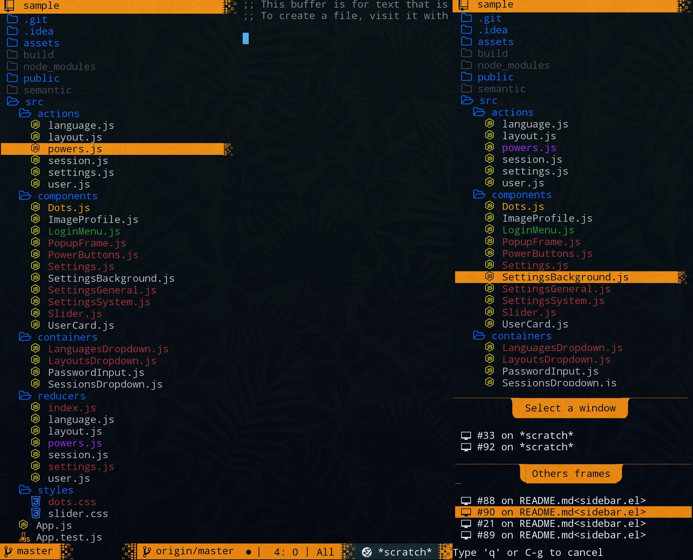

## Overview

`sidebar` is a customizable file explorer with git integration, but not only that. You can also get the list of buffers and your maildirs with mu4e.  

I had few problems with others similar projects, so I wrote this one:  
- With the others, we're limited to 1 instance per emacs instance, it's annoying when we're using emacs daemon.  
  `sidebar` is written in a way to be able to open one sidebar for each frame.  
- We can't select in which window we want to open the file. it's possible with `sidebar`  

Everything is customizable.  
The icons are available on both GUI and terminal versions.  
Please give me your feedback and open issue for bugs.  

## Dependencies

- `emacs 24.4`
- `icons-in-terminal` Optional but recommended (for both GUI and terminal)

## Installation

Please install [icons-in-terminal](https://github.com/sebastiencs/icons-in-terminal).  
Follow the instructions for emacs integration.  

`sidebar` is not yet available on [MELPA](https://melpa.org/).  
I'm waiting for feedbacks to add it on melpa.  
  
```bash
$ git clone https://github.com/sebastiencs/sidebar.el.git
```
Add those lines in your emacs init file:
```el
(add-to-list 'load-path "~/.local/share/icons-in-terminal/") ;; If it's not already done
(add-to-list 'load-path "PATH-TO-SIDEBAR-DIRECTORY")
(require 'sidebar)
(global-set-key (kbd "C-x C-f") 'sidebar-open)
(global-set-key (kbd "C-x C-a") 'sidebar-buffers-open)
```

`sidebar` require some packages: `dash`, `dash-functional`, `s`, `ov`, `projectile` and [frame-local](https://github.com/sebastiencs/frame-local).  
You can install them through melpa.  

## Default commands

| Key       | Command                       | Note                                                    |
| ----------|-------------------------------|---------------------------------------------------------|
| `RET`     | `sidebar-open-line`           | Open file or enter directory                            |
| `M-RET`   | `sidebar-open-line-in-window` | Open file in a selected window                          |
| `C-d`     | `sidebar-deleted-selected`    | Delete the file                                         |
| `C-h`     | `sidebar-history`             | Open the history of visited directory                   |
| `i`       | `sidebar-create-directory`    | Create a directory                                      |
| `n`       | `sidebar-create-file`         | Create a file                                           |
| `M-C`     | `sidebar-cut-selected`        | Cut the file                                            |
| `C`       | `sidebar-copy-selected`       | Copy the file                                           |
| `P`       | `sidebar-paste`               | Paste the file                                          |
| `?`       | `sidebar-help`                | Open `describe-mode`                                    |
| `R`       | `sidebar-rename-selected`     | Rename the file                                         |
| `g`       | `sidebar-refresh`             | Refresh the content of the sidebar                      |
| `q`       | `sidebar-close`               | Close sidebar                                           |
| `<tab>`   | `sidebar-switch-to-buffers`   | Switch to the list of buffers                           |
| `DEL`     | `sidebar-up-directory`        | Change the current directory to its parent (Backspace)  |
| `<right>` | `sidebar-adjust-window-width` | Adjust the window width if the filename is too long     |
| `<left>`  | `sidebar-reset-window-width`  | Reset the window width to the default value             |

## Commands with sidebar-buffers

| Key       | Command                          | Note                                                    |
| ----------|----------------------------------|---------------------------------------------------------|
| `RET`     | `sidebar-buffers-open-line`      | Open the buffer                                         |
| `M-RET`   | `sidebar-buffers-open-in-window` | Open the buffer in a selected window                    |
| `d`       | `sidebar-buffers-mark-delete`    | Mark the buffer to be delete                            |
| `s`       | `sidebar-buffers-mark-save`      | Mark the buffer to be save                              |
| `u`       | `sidebar-buffers-unmark`         | Unmark the buffer                                       |
| `x`       | `sidebar-buffers-mark-execute`   | Execute the action(s) on marked buffer(s)               |
| `q`       | `sidebar-buffers-close`          | Close sidebar                                           |
| `g`       | `sidebar-refresh`                | Refresh the content of the sidebar                      |
| `<tab>`   | `sidebar-switch-to-files`         | Switch to the list of files                             |
| `h`       | `sidebar-buffers-toggle-hidden`  | Show/hide the hidden buffers (starting with a space)    |
| `<right>` | `sidebar-adjust-window-width`    | Adjust the window width if the filename is too long     |
| `<left>`  | `sidebar-reset-window-width`     | Reset the window width to the default value             |
| `?`       | `sidebar-help`                   | Open `describe-mode`                                    |

## Commands with sidebar-mu4e

| Key       | Command                       | Note                                                    |
| ----------|-------------------------------|---------------------------------------------------------|
| `;`       | `sidebar-mu4e-switch-context` | Switch context on mu4e and refresh the sidebar content  |
| `RET`     | `sidebar-mu4e-open-line`      | Open the maildir or bookmark                            |
| `q`       | `sidebar-close`               | Close sidebar                                           |
| `<right>` | `sidebar-adjust-window-width` | Adjust the window width if the filename is too long     |
| `<left>`  | `sidebar-reset-window-width`  | Reset the window width to the default value             |
| `?`       | `sidebar-help`                | Open `describe-mode`                                    |


## Customization

To customize icons and behaviours of sidebar:  
`M-x customize-group [RET] sidebar [RET]`   
To customize the colors:  
`M-x customize-group [RET] sidebar-faces [RET]`  
To customize sidebar-buffers:  
`M-x customize-group [RET] sidebar-buffers [RET]`   
To customize sidebar-mu4e:  
`M-x customize-group [RET] sidebar-mu4e [RET]`   

You will likely want to customize `sidebar-primary-color`, most of the faces inherit from it.

## Screenshots




## TODO

See [here](https://github.com/sebastiencs/sidebar.el/projects/1)
